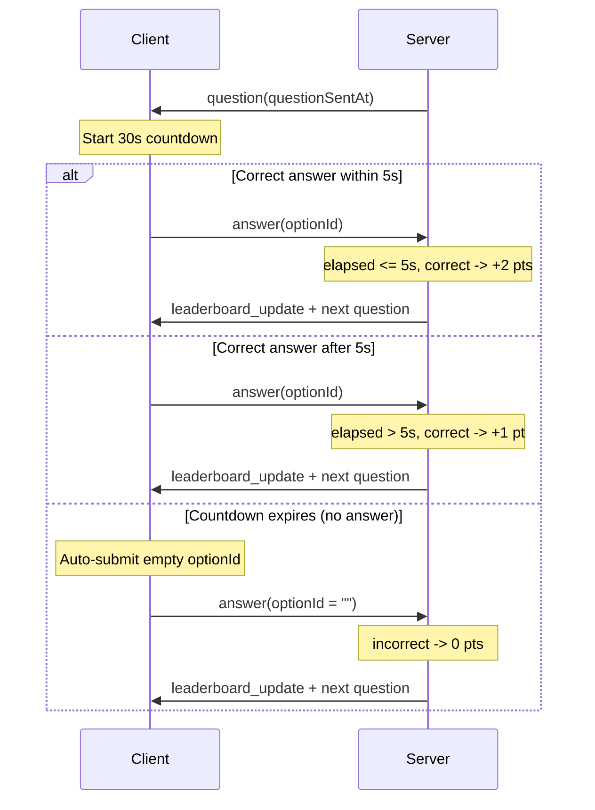

# Countdown Quiz Feature

## Current State

- Questions are self-paced: no time limit, no countdown.
- Scoring: correct = +1, incorrect = +0 (`scoreAnswer` in [server/src/quiz_service.ts](server/src/quiz_service.ts)).
- The server sends a `question` message; the client displays it and waits indefinitely for the user to submit.
- No timer on client or server.

## Design (Simplified)

No new message types. The countdown lives on the **client**. When it expires, the client auto-submits the existing `answer` message with an empty `optionId`. The server treats an empty/invalid `optionId` as incorrect (0 points) and advances to the next question -- same as a wrong answer.

For double-points scoring, the server tracks when it sent the question (per-socket, in-memory). When an answer arrives, the server computes elapsed time itself (tamper-resistant) and awards 2 points if correct and fast.



## Server Changes

### 1. Track question sent time ([server/src/index.ts](server/src/index.ts))

- Add `questionSentAt?: number` (epoch ms) to the `ConnectionData` interface.
- When sending a question to a socket, record `Date.now()` in `ws.data.questionSentAt`.
- Include `questionSentAt` as an ISO string in the `question` message payload so the client can display it.

### 2. Update scoring logic ([server/src/quiz_service.ts](server/src/quiz_service.ts))

- Change `scoreAnswer` to accept elapsed milliseconds:

```typescript
const scoreAnswer = (isCorrect: boolean, elapsedMs: number): number => {
  if (!isCorrect) return 0;
  return elapsedMs <= 5000 ? 2 : 1;
};
```

- `handleAnswer` receives `questionSentAt` (from `ConnectionData`), computes `elapsedMs = Date.now() - questionSentAt`, and passes it to `scoreAnswer`.

### 3. Handle empty optionId as no-answer ([server/src/quiz_service.ts](server/src/quiz_service.ts))

- In `handleAnswer`, if `optionId` is empty, treat as incorrect immediately (skip the `isOptionCorrect` DB call).
- Record the answer with `is_correct = false`, advance progress, broadcast leaderboard, send next question -- exactly the same flow as a wrong answer.
- Update `isAnswerMessage` validation in [server/src/index.ts](server/src/index.ts) to allow empty string for `optionId`.

### 4. Add `questionSentAt` to question message ([server/src/models.ts](server/src/models.ts))

- Add `questionSentAt: string` field to `QuestionMessage` interface.

## Client Changes

### 5. Add countdown timer to ViewModel ([client/lib/data/quiz_view_model.dart](client/lib/data/quiz_view_model.dart))

- Add `Timer? _countdownTimer` and `int remainingSeconds = 30`.
- When a `question` message arrives in `_handleMessage`, cancel any existing timer and start a new periodic 1-second timer.
- Each tick: decrement `remainingSeconds`, call `notifyListeners()`.
- When `remainingSeconds` reaches 0: call a new `_autoSubmitNoAnswer()` method that sends the existing answer message with `optionId: ""` for the current question, then clears `currentQuestion`.
- Cancel timer on manual answer submission and in `dispose()`.

### 6. Update UI with countdown ([client/lib/ui/quiz_screen.dart](client/lib/ui/quiz_screen.dart))

- Pass `remainingSeconds` from the ViewModel into `_QuestionSection`.
- Display countdown as large text or a progress indicator above the question.
- Color coding: normal (> 10s), warning/orange (5-10s), red (< 5s).
- Show a "Double Points!" badge when `remainingSeconds > 25` (within the first 5 seconds).

## Tests

### 7. Server tests ([server/tests/quiz_service.test.ts](server/tests/quiz_service.test.ts))

- `scoreAnswer(true, 3000)` returns 2 (double points).
- `scoreAnswer(true, 8000)` returns 1 (normal points).
- `scoreAnswer(false, 2000)` returns 0.
- `handleAnswer` with empty `optionId` awards 0 points and advances progress.
