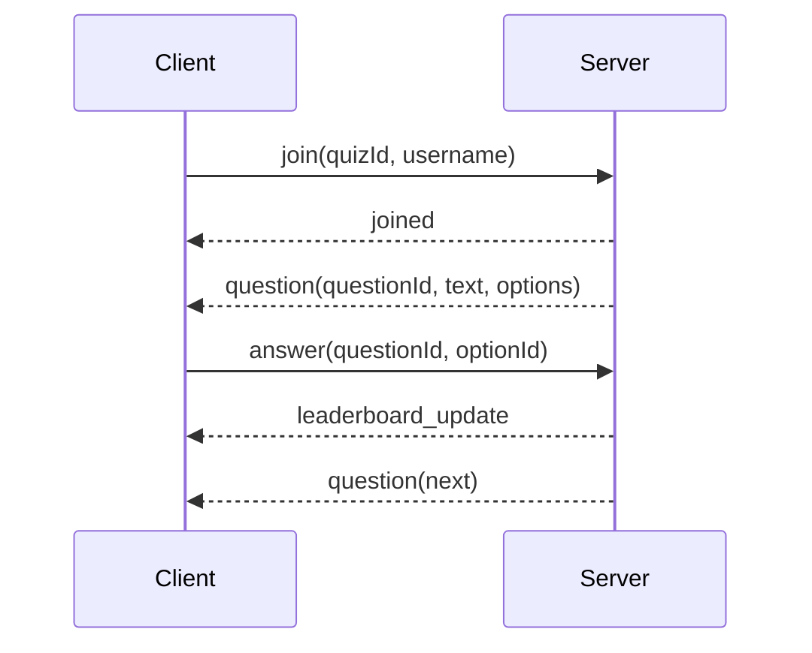

# Q&A Feature Plan

## Goals

- Add server-side question storage and seeding (100 questions, 4 options each).
- Make the server validate correctness and award points.
- Update the Flutter client to show one question at a time with 4 options and submit a choice.
- Add tests for scoring/validation behavior.

## Server changes

- Extend the SQLite schema in [`/Users/huy.ly/personal/coding-challenges/server/src/db.ts`](/Users/huy.ly/personal/coding-challenges/server/src/db.ts) with tables for questions and options (e.g., `questions`, `question_options`) and a lightweight mapping to a quiz session if needed.
- Add seed logic that inserts 100 questions with four options and one correct option on startup (only if table is empty to keep idempotent). Locate in [`/Users/huy.ly/personal/coding-challenges/server/src/db.ts`](/Users/huy.ly/personal/coding-challenges/server/src/db.ts) or a new seed module called from [`/Users/huy.ly/personal/coding-challenges/server/src/index.ts`](/Users/huy.ly/personal/coding-challenges/server/src/index.ts).
- Add DB helpers to fetch the “next” question for a user (or for a quiz) and to validate an answer choice by option id. This will be used by the service layer (update [`/Users/huy.ly/personal/coding-challenges/server/src/quiz_service.ts`](/Users/huy.ly/personal/coding-challenges/server/src/quiz_service.ts)).
- Update the WebSocket message types in [`/Users/huy.ly/personal/coding-challenges/server/src/models.ts`](/Users/huy.ly/personal/coding-challenges/server/src/models.ts) to:
  - Accept an answer payload with `questionId` and `optionId` only (remove `isCorrect` from client input).
  - Add a server message to deliver the current question with its 4 options.
- Update the message handling in [`/Users/huy.ly/personal/coding-challenges/server/src/index.ts`](/Users/huy.ly/personal/coding-challenges/server/src/index.ts) to send the first question on join and the next question after each answer is processed.
- Update `handleAnswer` in [`/Users/huy.ly/personal/coding-challenges/server/src/quiz_service.ts`](/Users/huy.ly/personal/coding-challenges/server/src/quiz_service.ts) to compute correctness server-side, store the answer, increment score, and return leaderboard + next question.

## Client changes

- Add question/option models in [`/Users/huy.ly/personal/coding-challenges/client/lib/models/quiz_models.dart`](/Users/huy.ly/personal/coding-challenges/client/lib/models/quiz_models.dart) for the new server question message.
- Update the view model in [`/Users/huy.ly/personal/coding-challenges/client/lib/data/quiz_view_model.dart`](/Users/huy.ly/personal/coding-challenges/client/lib/data/quiz_view_model.dart) to:
  - Track the current question and selected option.
  - Send answers using `questionId` and `optionId`.
  - Update state when a question message arrives.
- Update the UI in [`/Users/huy.ly/personal/coding-challenges/client/lib/ui/quiz_screen.dart`](/Users/huy.ly/personal/coding-challenges/client/lib/ui/quiz_screen.dart) to render a single question with 4 selectable options and a submit button (no manual question id or isCorrect toggle).

## Tests

- Extend [`/Users/huy.ly/personal/coding-challenges/server/tests/quiz_service.test.ts`](/Users/huy.ly/personal/coding-challenges/server/tests/quiz_service.test.ts) to cover:
  - Correct answer increments score.
  - Incorrect answer leaves score unchanged.
  - Server validation uses stored correct option.
- Add DB tests in [`/Users/huy.ly/personal/coding-challenges/server/tests/db.test.ts`](/Users/huy.ly/personal/coding-challenges/server/tests/db.test.ts) for question seeding and correctness lookup (e.g., fetch question/options, validate option id).

## Notes & assumptions

- Server is the source of truth for correctness; client never sends `isCorrect`.
- Question sequencing can be simple deterministic ordering (e.g., by numeric id) for now; later we can randomize if needed.

## Diagram (message flow)

## Todos

- [ ] Update server schema + seed 100 questions
- [ ] Implement question fetch/validation + message types
- [ ] Update client models/view model/UI for single-question flow
- [ ] Add/adjust tests for correctness and seeding
