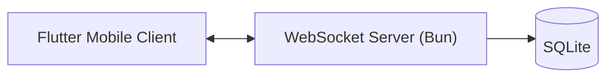

# Mermaid diagram rendering issue
_Exported on 1/28/2026 at 12:56:11 GMT+7 from Cursor (2.4.21)_

---

**User**

Architecture diagram
Unable to render rich display

Parse error on line 3:
...er[WebSocket Server (Bun)] DB[(sqlite)
-----------------------^
Expecting 'SQE', 'DOUBLECIRCLEEND', 'PE', '-)', 'STADIUMEND', 'SUBROUTINEEND', 'PIPE', 'CYLINDEREND', 'DIAMOND_STOP', 'TAGEND', 'TRAPEND', 'INVTRAPEND', 'UNICODE_TEXT', 'TEXT', 'TAGSTART', got 'PS'

For more information, see https://docs.github.com/get-started/writing-on-github/working-with-advanced-formatting/creating-diagrams#creating-mermaid-diagrams

flowchart LR
  Client[Flutter Mobile Client]
  Server[WebSocket Server (Bun)]
  DB[(sqlite)]

  Client <--> Server
  Server --> DB

Fix a diagram render issue at github @SYSTEM_DESIGN.md 

---

**Cursor**

Updated the Mermaid node labels in `SYSTEM_DESIGN.md` to use quoted text and a standard cylinder syntax for the database. This avoids GitHub’s parser choking on the label tokens and keeps the diagram intact.

If you want, I can also run a quick preview check or adjust styling (icons, colors).

---

**User**

@SYSTEM_DESIGN.md:9-17 Generate flow chart here

---

**Cursor**

Here’s the flowchart block to place at `SYSTEM_DESIGN.md:9-17`:

