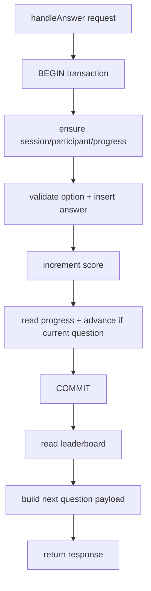

## Plan: Confidence-First Improvement for `quiz_service.ts` Under Stress

### Summary
Use a single explicit SQLite transaction in `handleAnswer` to reduce write-lock churn and keep answer/score/progress updates atomic, then keep expensive read/broadcast work outside the transaction.  
This is prioritized because the latest stress result at `/Users/huy.ly/personal/coding-challenges/server/stress-results/2026-02-15T03-23-37-403Z-ws.json` shows a contention pattern:
1. Stage 1 (100 RPS): pass, `p95=8.7ms`, `errorRate=0`.
2. Stage 2 (150 RPS): fail, `p95=3167.62ms`, `errorRate=18.59%`, `timeouts=371`.
3. Stage 3 (200 RPS): fail, `p95=3192.2ms`, `errorRate=59.65%`, `timeouts=1277`.

### Implementation Scope
1. Update `/Users/huy.ly/personal/coding-challenges/server/src/quiz_service.ts`.
2. Update `/Users/huy.ly/personal/coding-challenges/server/src/db.ts`.
3. Update tests in `/Users/huy.ly/personal/coding-challenges/server/tests/quiz_service.test.ts` and `/Users/huy.ly/personal/coding-challenges/server/tests/db.test.ts`.
4. Re-run stress bench using the same WS config for before/after comparison.

### Detailed Changes
1. In `/Users/huy.ly/personal/coding-challenges/server/src/quiz_service.ts`, refactor `handleAnswer` to use a transaction boundary for mutation steps only.
2. Keep `ensureSession`, `ensureParticipant`, `ensureParticipantProgress`, `isOptionCorrect`, `insertAnswer`, `incrementScore`, `getParticipantProgress`, and conditional `advanceParticipantProgress` inside one `db.transaction`.
3. Return `{ isCorrect, nextIndex }` from the transaction closure.
4. After transaction commit, run `getLeaderboard` and `buildQuestionPayload(nextIndex)` outside the transaction.
5. Keep current behavior and return shape unchanged (`leaderboard`, `question`, `isCorrect`).

### DB-Level Tightening (same change set)
1. In `/Users/huy.ly/personal/coding-challenges/server/src/db.ts`, change `incrementScore` from `UPDATE` + `SELECT` to single statement:
2. Use `UPDATE ... RETURNING score` so function contract remains unchanged while removing one query per answer path.
3. Keep function signature stable to avoid caller/API ripple.

### Public APIs / Interfaces / Types
1. No external protocol changes in `/Users/huy.ly/personal/coding-challenges/server/src/models.ts`.
2. No WebSocket message shape changes from `/Users/huy.ly/personal/coding-challenges/server/src/index.ts`.
3. `incrementScore` return contract remains `number`; only internal SQL execution strategy changes.

### Test Cases and Scenarios
1. Unit tests: all existing tests in `/Users/huy.ly/personal/coding-challenges/server/tests/quiz_service.test.ts` must pass unchanged.
2. Unit tests: all existing tests in `/Users/huy.ly/personal/coding-challenges/server/tests/db.test.ts` must pass unchanged.
3. Add test: `handleAnswer` keeps score/progress consistency after one call (`answers` row exists, score matches delta, next question index advances correctly).
4. Add test: `handleAnswer` wrong/out-of-order answer does not advance progress and still returns current question payload.
5. Add test: `incrementScore` still returns correct value for existing and missing participant with the `RETURNING`-based implementation.
6. Stress validation: rerun WS stress with same knobs as failing run (`STRESS_STAGE_RPS=100,150,200`, `STRESS_STAGE_DURATION_MS=15000`, `STRESS_CONCURRENCY=200`, `STRESS_RESPONSE_TIMEOUT_MS=3000`) and compare against baseline JSON above; success means lower stage-2/3 timeout and error-rate trends without regression at 100 RPS.

### Assumptions and Defaults
1. SQLite in runtime supports `RETURNING` (validated in local sqlite).
2. Real-time leaderboard behavior must stay prompt per `/Users/huy.ly/personal/coding-challenges/docs/REQUIREMENT.md`.
3. No schema migration is required for this change set.
4. No client-side or wire-protocol modifications are allowed in this plan.
